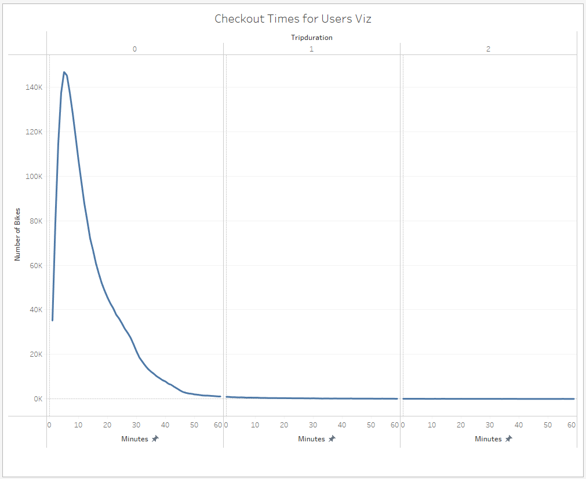

# bikesharing

# Bikesharing Challenge Report

## Overview of the Analysis
The analysis aims to investigate NYC Citibike usage patterns and customer behaviors to inform business decisions. NYC Citibike is a popular bike-sharing service in New York City with over 2.3 million customers, including 1.9 million subscribers.

## Tableau public Story
https://public.tableau.com/app/profile/zachary.barham/viz/bikesharingChallengeStory/bikesharingChallengeStory?publish=yes

## Data Preparation

The analysis began with acquiring the NYC Citibike data, stored in a CSV format. A significant step in preparing this dataset for analysis involved cleaning and transforming the "tripduration" column. I converted this column to a datetime datatype, from an interger value in seconds, providing a more readable and understandable format for the analysis. The transformation of this column facilitated deeper insights into the duration of bike trips in subsequent visualizations.

## Results

### Visualization 1: Customer Overview

NYC Citibike has a large customer base of over 2.3 million, with the majority being subscribers to their service. 

### Visualization 2: Ride Start Locations

Many customers start their rides from lower Manhattan, suggesting a high demand in this area.

### Visualization 3: Ride Timings

While NYC Citibike has customers at all times of the day, the majority of rides occur during the day with peaks at the workday AM and PM rush hours. This indicates that the service is heavily used for commuting to and from work.

### Visualization 4: Ride Duration

Most bike trips are under 10 minutes, suggesting that the service is mainly used for short commutes.

### Visualization 5: User Data by Gender

Male customers form the majority, but the ride time is similar across genders. Interestingly, users who did not report their gender tend to have slightly longer trips.

### Visualization 6: Heatmap of Usage by Time

This heatmap shows that peak usage occurs at the start and end of the workday on weekdays. On weekends and Friday afternoons, there is more mid-day usage.

### Visualization 7: Heatmap of Usage by Gender
 Viz - No Legend.png)
The heatmap of usage by gender shows similar trends for all users. However, users who did not report their gender show more usage during weekends.

### Visualization 8: User Type Usage

Separating usage between Subscribers and Customers, we see that users who did not report their gender are generally single-use customers. These users tend to use the service more during weekends, suggesting they may be tourists or occasional users.

## Summary

In summary, the NYC Citibike service is a popular mode of transportation for short commutes, especially during rush hours on weekdays. The service is predominantly used by male subscribers, but there are also a significant number of single-use customers, particularly during weekends. These insights suggest that efforts to increase the subscriber base and improve service availability during peak times could further enhance the success of the service.

For future analysis, it would be useful to investigate the following:

1. The impact of weather conditions on Citibike usage.
2. The geographical distribution of demand and how this corresponds to the locations of bike stations.
